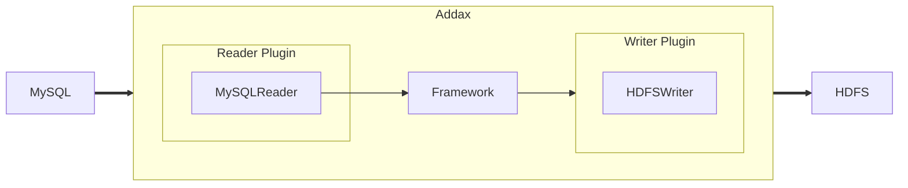
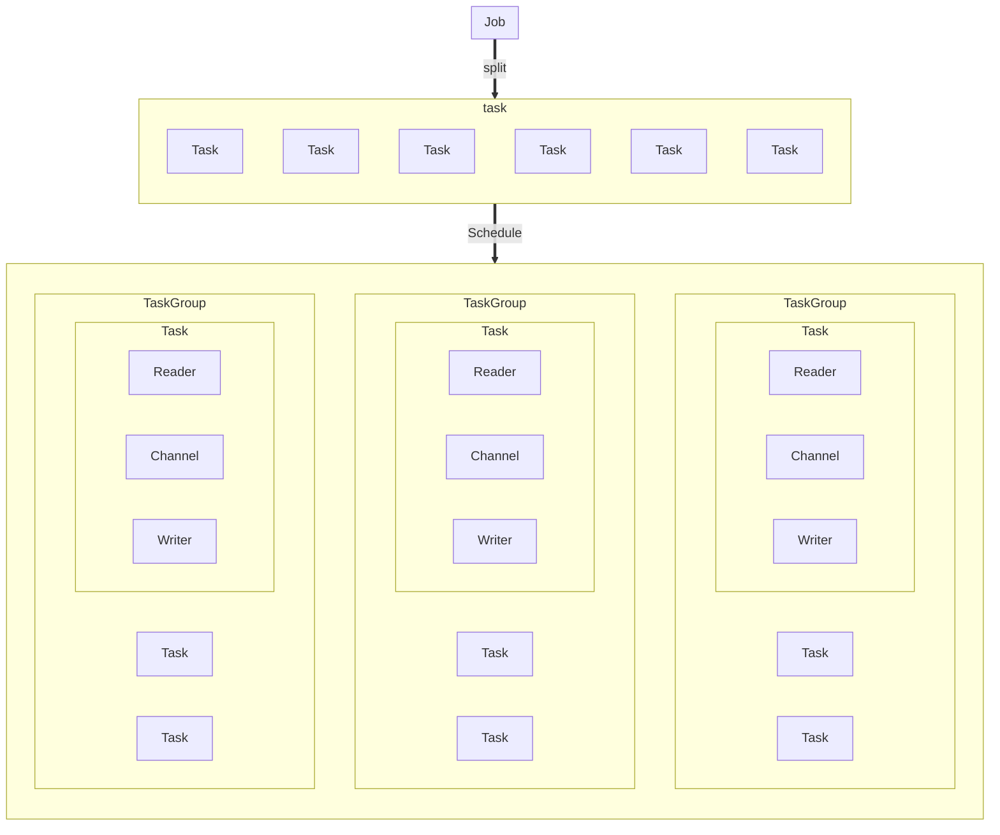

# Addax Introduction

## Overview

Addax is a versatile open-source ETL tool that can seamlessly transfer data between various RDBMS and NoSQL databases, making it an ideal solution for data migration.


To solve the problem of synchronizing heterogeneous data sources, Addax transforms complex mesh synchronization links into star-shaped data links. Addax acts as an intermediate transfer medium to connect various data sources. When a new data source needs to be accessed, you only need to connect this data source to Addax to achieve seamless data synchronization with existing data sources.

## Framework Design



Addax itself is an offline data synchronization framework that adopts a framework + plugin architecture. The data source reading and writing are abstracted into Reader/Writer plugins and incorporated into the entire synchronization framework.
- Reader: The Reader is the data collection module responsible for collecting data from the data source and sending the data to the Framework.
- Writer: The Writer is the data writing module responsible for continuously obtaining data from the Framework and writing the data to the destination. 
- Framework: The Framework is used to connect the Reader and the Writer, acting as a data transmission channel between them, and handling core technical issues such as buffering, flow control, concurrency, and data conversion.
The Addax Framework provides a simple interface to interact with plugins and a simple plugin access mechanism. Just adding any plugin can seamlessly dock with other data sources. 

## Core Framework

This section briefly describes the relationship between each module according to the sequence diagram of an Addax job life cycle from the overall architecture design.



## Core Module Introduction

1. Addax completes the synchronization of a single set of data, which we call Job. After Addax receives a Job, it will start a process to complete the entire job synchronization process. The Addax Job module is the central control node of a single job, assuming functions such as data cleanup, subtask splitting (converting a single job into multiple subtasks), and TaskGroup management.
2. After Addax Job starts, it will split the Job into multiple small Tasks (subtasks) according to different source splitting strategies to facilitate concurrent execution. Task is the smallest unit of Addax job, and each Task is responsible for synchronizing part of the data. 
3. After splitting into multiple Tasks, the Addax Job will call the Scheduler module. According to the configured concurrency data volume, the split Tasks will be recombined into TaskGroups (task groups). Each TaskGroup is responsible for running all assigned Tasks with a certain concurrency. The default concurrency of a single task group is 5. 
4. Each Task is started by TaskGroup. After the Task starts, it will start Reader->Channel->Writer threads to complete the task synchronization work. 
5. After the Addax job starts running, the Job monitors and waits for multiple TaskGroup modules to complete the task. After all TaskGroup tasks are completed, the Job successfully exits. Otherwise, it exits abnormally and the process exit value is non-zero.

### Scheduling Process
For example, a user submits a job and configures 20 concurrencies to synchronize data from a 100-table MySQL database to Oracle. The scheduling decision-making process is:

1. Addax Job splits into 100 Tasks according to the sub-database and sub-table. 
2. According to 20 concurrencies, calculate a total of 20/5 = 4 TaskGroups. 
3. The 4 TaskGroups evenly split the split 100 Tasks, with each TaskGroup running 25 Tasks concurrently with 5 concurrencies. 

## Core Advantages 

### Reliable Data Quality Monitoring  

- Perfectly solve the problem of individual data type distortion during data transmission.
  Support for all strong data types. Each plugin has its own data type conversion strategy to ensure that data can be transmitted to the destination completely and losslessly.
- Provide runtime monitoring of data flow, data volume, and job status across the entire link.  
  During operation, information such as job status, data flow, data speed, progress, etc. can be fully displayed to allow users to understand the job status in real time. And it can intelligently compare the speeds of the source and destination during the job execution process to provide users with more performance troubleshooting information. 
- Provide dirty data detection 
  In the process of transferring a large amount of data, many data transfers will inevitably fail for various reasons (such as type conversion errors). Addax considers this kind of data to be dirty data. Addax can currently accurately filter, identify, collect and display dirty data, providing users with multiple dirty data processing models to accurately control data quality! 

### Rich Data Conversion Functions

As an ETL tool serving big data, in addition to providing data snapshot transfer functions, Addax also provides rich data conversion functions to easily complete data desensitization, supplementation, filtering and other data conversion functions during the data transfer process. Addax also provides automatic groovy functions for users to define custom conversion functions. For details, please see the [transformer](transfomer) detailed introduction.

### Precise Speed Control

It provides three flow control modes: channel (concurrency), record flow, and byte flow, which can freely control the speed of your job so that your job can achieve the optimal synchronization speed within the range that the database can bear.

```json
{
  "speed": {
    "channel": 5,
    "byte": 1048576,
    "record": 10000
  } 
}
```

### Powerful Synchronization Performance

Each Reader plugin has one or more splitting strategies that can reasonably split the job into multiple Tasks for parallel execution. The single-machine multi-threading execution model can increase the speed linearly with concurrency.
When the performance of the source and destination is sufficient, a single job can definitely saturate the network card.

### Robust Fault Tolerance Mechanism 

Jobs are extremely susceptible to external factors such as network flash breaks and unstable data sources, which can easily cause jobs that are halfway synchronized to report errors and stop. Therefore, stability is a basic requirement of Addax. In the design of Addax, the stability of the framework and plugins has been improved.
Currently, Addax can achieve multi-level local/global retries at the thread level and job level to ensure the stable operation of user jobs. 